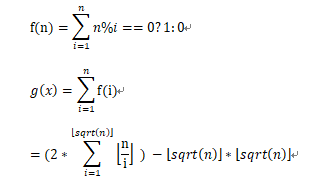

**20级学弟学妹们记得补题嗷**

<h2>A 小Q要签到!</h2>


<h3>题面</h3>

给n个a，b，c的整数（范围都在[1,1000]），问有没有两个整数x，y，使得a * x+b * y=c

如果有输出yes，没有输出no

<h3>思路</h3>

思路一：因为时限给了3000ms，所以可以暴力找x和y从-1000到1000的4e6种情况

思路二：也可以用gcd做，c%gcd(a,b)=0就是yes，其余都是no

<h3>ac代码</h3>

思路一

```
#include<bits/stdc++.h>
using namespace std;
int main(){
    int t;
    scanf("%d",&t);
    while(t--){
        int n,p,q;
        scanf("%d%d%d",&n,&p,&q);
        int flag=0;
        for(int i=-1000;i<=1000;i++){
            for(int j=-1000;j<=1000;j++){
                if(i*n+j*p==q){
                    printf("yes\n");flag=1;break;
                }
            }
            if(flag){break;}
        }
        if(!flag){
            printf("no\n");
        }
    }
    return 0;
}
```
思路二
```
#include<bits/stdc++.h>
using namespace std;
int main(){
	int t,a,b,c;
	scanf("%d",&t);
	while(t--){
		scanf("%d%d%d",&a,&b,&c);
		if(c%__gcd(a,b)==0) printf("yes\n");
        else printf("no\n");
	}
	return 0;
}
```

<h2>B 你不要过来啊！</h2>


<h3>题面</h3>

给二维坐标点（x，y），给n个字符串，WASD代表上左下右，问每次从（0，0）开始走能到（x，y）吗，走到YES，没走不到NO

<h3>思路</h3>

签到，按照字符串模拟

<h3>ac代码</h3>

```
#include<bits/stdc++.h>
using namespace std;
char s[110];
int main(){
    int t;
    scanf("%d",&t);
    int x,y;
    scanf("%d%d",&x,&y);
    while(t--){
        scanf("%s",s);
        int l=strlen(s);
        int x1=0,y1=0;
        for(int i=0;i<l;i++){
            if(s[i]=='W') y1++;
            else if(s[i]=='A') x1--;
            else if(s[i]=='S') y1--;
            else if(s[i]=='D') x1++;
        }
        if(x==x1 && y1==y) printf("YES\n");
        else printf("NO\n");
    }
    return 0;
}
```

<h2>C 十里坡剑神（二）</h2>

<h3>题面</h3>

输入有n个亡灵逆转和m个血脉骤杀

血脉骤杀能杀死一个丘丘人（效果等效于死亡数 +1），亡灵逆转能使得每个已经死去的丘丘人在一瞬间会同步杀死一个丘丘人（效果等效于死亡数 * 2）

能杀多少丘丘人？（因为数量可能过大，需要取余，模数为998244353）

<h3>思路</h3>

很明显2^n * m，但因为数据2e7，所以我们这里引进一个简单的算法，快速幂（不懂的学弟可自行百度或者问学长）

<h3>ac代码</h3>

```
#include<bits/stdc++.h>
#define ll long long
using namespace std;
int pow_mod(ll a, ll n){
    ll m=998244353;
    long long ans = 1;
    while(n){
        if(n&1){
            ans = (ans * a) % m;
        }
        a = (a * a) % m;
        n >>= 1;
    }
    return ans;
}
int main(){
    int n,m;
    ll sum;
    while(~scanf("%d%d",&n,&m)){
        int mod=998244353;
        sum=m;
        sum=sum*pow_mod(2,n)%mod;
        printf("%lld\n",sum);
    }
    return 0;
}
```

<h2>D 十里坡剑神（三）</h2>

<h3>题面</h3>

输入n个长度为l（l<=50）的两个整数，大数相加

<h3>思路</h3>

模拟即可

<h3>ac代码</h3>

```
#include<bits/stdc++.h>
#define ll long long
#define mem(a,b) memset(a,b,sizeof(a))
using namespace std;
char s[55],ss[55];
int k[55];
int main(){
    int t;
    scanf("%d",&t);
    while(t--){
        int n;scanf("%d",&n);
        scanf("%s%s",&s,&ss);
        int c=0;
        for(int i=n-1;i>=0;i--){
            k[i]=c+s[i]+ss[i]-'0'-'0';
            c=k[i]/10;k[i]%=10;
        }
        if(c){
            printf("%d",c);
           for(int i=0;i<n;i++)printf("%d",k[i]);
        }
        else{
            for(int i=0;i<n;i++)printf("%d",k[i]);
        }
        printf("\n");
    }
    return 0;
}
```

<h2>E 小小攀登者</h2>

<h3>题面</h3>

给n和m两个整数，再给长度为n的数组，可以从数值低到数值高，但从数值高到数值低的差需要小于等于m，如果大于就要把数值高的值减到两者差小于等于m

问最小减去多少单位

<h3>思路</h3>

因为正着遍历不利于判断，如果需要减少数值，会对前面判断过的数值造成影响，所以我们倒着遍历即可

看好多学弟卡了，这里解释下一组数据，为什么要倒着

3 0

5 5 3

因为5->3，不能走，所以要削成3，但如果你不削第一个5的话，当你第一个五走到被削成的3的时候又不能走，所以这题要预判，把第一个五也削成3
<h3>ac代码</h3>

```
#include<bits/stdc++.h>
using namespace std;
int h[100010];
int main(){
    int n,m;
    while(~scanf("%d%d",&n,&m)){
        for(int i=1;i<=n;i++){
            scanf("%d",&h[i]);
        }
        int sum=0;
        for(int i=n-1;i>=1;i--){
            if(h[i]-h[i+1]>m){
                sum+=(h[i]-(h[i+1]+m));
                h[i]=h[i+1]+m;
            }
        }
        printf("%d\n",sum);
    }
    return 0;
}
```

<h2>F 赛博朋克2020</h2>

<h3>题面</h3>

求1582年10月15号之后的年份到2077还要多少天

<h3>思路</h3>

当输入2077年份的时候，day永远是0天

判断闰年和注意输出的格式即可

<h3>ac代码</h3>

```
#include<bits/stdc++.h>
#define ll long long
#define mod 10
using namespace std;
int day[12]={31,28,31,30,31,30,31,31,30,31,30,31};
int pan(int year){
    return (year%4==0 &&year%100!=0)||(year%400==0);
}
int main(){
    int y,m,d;
    while(~scanf("%d-%d-%d",&y,&m,&d)){
         if(y==0 && m==0 && d==0){return 0;}
         if(y==2077){printf("0 day to 2077\n");continue;}
         int ans=0;
         ans=day[m-1]-d+1;
         if(pan(y) && m<=2){
            ans++;
         }
         for(int i=m;i<12;i++){
            ans+=day[i];
         }
         for(int i=y+1;i<2077;i++){
            if(pan(i)) ans+=366;
            else ans+=365;
         }
         if(ans==1)printf("1 day to 2077\n");
         else printf("%d days to 2077\n",ans);
    }
    return 0;
}
```

<h2>G 猫和老鼠</h2>

<h3>题面</h3>

老鼠们排成一队，每个老鼠都按位置有自己的编号，Tom会放过一只老鼠，Tom按照天数来判断是吃奇数位置上还是偶数位置上的老鼠。

最后活下来的一只老鼠就被放生了。Jerry要知道自己站几号才能活.

<h3>思路</h3>

思路一：因为每次去掉一半，所以是log2级别的，模拟即可

思路二：找规律，会发现1个1号 4个2号 16个6号 64个22号

于是发现了1到1是0+1=1，2到5是1+1=2，6到21是1+4+1=6，22到85是1+4+16+1=22

就是4^n的前缀和

<h3>ac代码</h3>

思路一
```
#include<bits/stdc++.h>
using namespace std;
int p[2][1000010];
int main(){
    int n;
    while(~scanf("%d",&n)){
        int k=n,c=1;
        for(int i=1;i<=n;i++){
            p[0][i]=i;
        }
        while(k!=1){
            int cnt=0,j=c%2;
            for(int i=c%2+1;i<=k;i+=2){
                p[j][++cnt]=p[1-j][i];
            }
            k=cnt;c++;
        }
        c++;
        printf("%d\n",p[c%2][1]);
    }
    return 0;
}

```
思路二
```
#include<bits/stdc++.h>
using namespace std;
int p[15];
int a[15];
int main(){
    int n;
    p[1]=1;
    for(int i=2;i<15;i++){
        p[i]=p[i-1]*4;
    }
    a[0]=0;a[1]=p[1];
    for(int i=2;i<15;i++){
        a[i]=a[i-1]+p[i];
    }
    while(~scanf("%d",&n)){
        int pos=0;
        for(int i=1;i<15;i++){
            if(n>a[i]){
                pos=a[i];
            }
        }
        printf("%d\n",pos+1);
    }
    return 0;
}
```

<h2>H 萧山杨少</h2>

<h3>题面</h3>

 输出n^m的个位数字乘上1e5

<h3>思路</h3>

思路一：快速幂，mod为10

思路二：用提示做，对于任意一个整数X,X^5的个位数等于其X的个位数，m%5

<h3>ac代码</h3>

思路一
```
#include<bits/stdc++.h>
#define ll long long
#define mod 10
using namespace std;
ll n,m;
ll ans;
ll ksm(ll a,ll b){
    ll ans=1;
    while(b){
        if(b&1){
            ans*=a;ans%=mod;
        }
        a*=a;a%=mod;
        b>>=1;
    }
    return ans;
}
int main(){
    int t;
    scanf("%d",&t);
    while(t--){
        scanf("%lld%lld",&n,&m);
        printf("%lld\n",ksm(n,m)*100000);
    }
    return 0;
}
```
思路二
```
#include<bits/stdc++.h>
using namespace std;
int main(){
	int n,m,t;
	scanf("%d",&t);
	while(t--){
		scanf("%d%d",&n,&m);
		m=(m-1)%4;
		n%=10;
		if(m==0)
			printf("%d\n",n*100000);
		else	
			printf("%d\n",(int)(pow(n,m+1))%10*100000);
	}
	return 0;
} 
```

<h2>I 八奇的金子</h2>

<h3>题面</h3>

求1~n的因子个数之和

<h3>思路</h3>




~~不好意识上面那个图算的是g（n）不是g(x),懒狗不想再搞一遍了~~

<h3>ac代码</h3>

```
#include <bits/stdc++.h>
#define ll long long
using namespace std;
int main(){
    ll n;
    int t;
    cin>>t;
    while(t--){
        cin>>n;
        ll k=(ll)sqrt(n);
        ll sum=0;
        for(ll i=1;i<=k;i++){
            sum+=(ll)(n/i);
        }
        sum*=2;sum-=k*k;
        cout<<sum<<endl;
    }
    return 0;
}
```

<h2>J ouluy爱画画</h2>
<h3>思路</h3>
签到题
<h3>ac代码</h3>

```
#include<stdio.h>
int main(){
    int n,m;
    scanf("%d%d",&n,&m);int h=m-n;
    for(int i=0;i<=h;i++){
       for(int j=0;j<n;j++)printf("*");
       printf("\n");n++;
    }
    return 0;
}
```
